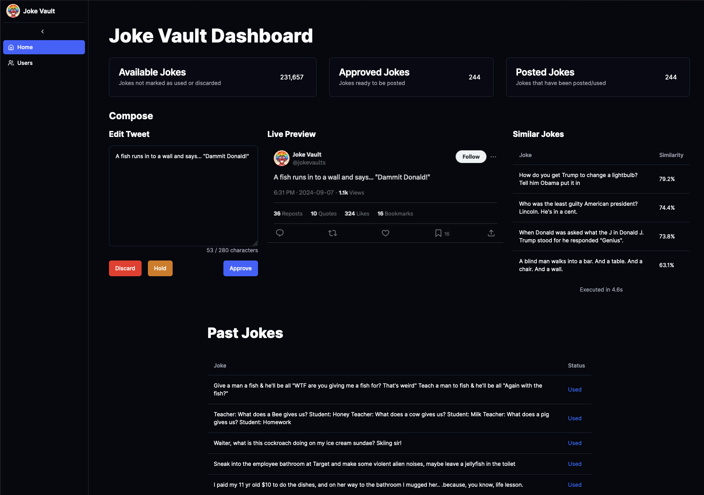
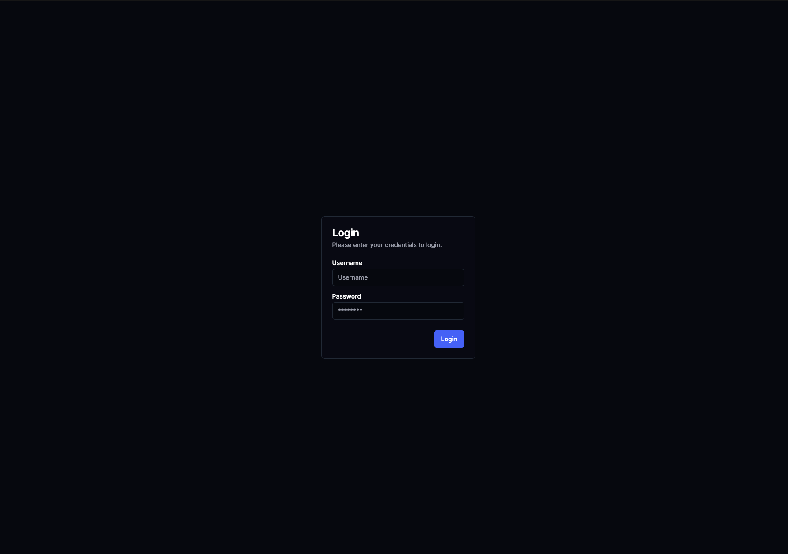
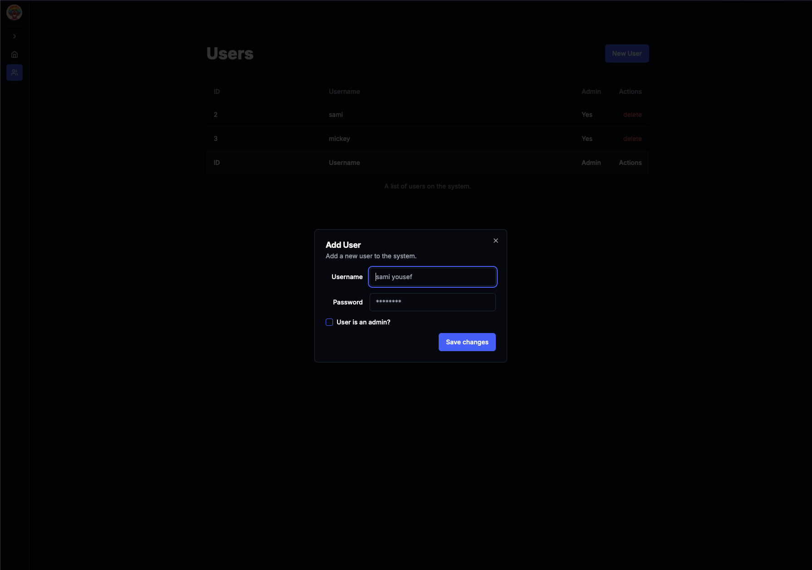

# Content Vault 📚

Content Vault is an AI-powered content management system designed for content creators, social media managers, and digital marketers. It streamlines the process of curating, approving, and posting various types of text-based content on Twitter/X.

## 🚀 Features

- **Smart Similarity Matching**: Utilize advanced embedding techniques to find similar content and avoid repetition.
- **Automated Social Media Posting**: Seamlessly post approved content to Twitter with customizable tweet generation.
- **Secure User Management**: Role-based access control with admin capabilities for user management.
- **Intuitive Dashboard**: Insightful metrics on available, approved, and posted content.
- **Content Approval Workflow**: Efficiently review, approve, hold, or discard content pieces.

## 🛠️ Technology Stack

- **Frontend**: Next.js with React and TypeScript
- **Backend**: Next.js with API routes and server actions
- **Database**: PostgreSQL with Sequelize ORM for data storage. CozoDB for vector storage and similarity matching.
- **Authentication**: JWT-based auth with middleware protection
- **AI Integration**: Python-based embedding model for similarity matching
- **Styling**: Shadcn/ui for responsive design and components

## 🏗️ Project Structure

- `/src/app`: Next.js app router structure
- `/src/components`: Reusable React components
- `/src/actions`: Server-side actions for data manipulation
- `/src/lib`: Utility functions and database configurations
- `/public`: Static assets including tweet templates

## 🚀 Getting Started
To run this project, you need to have an instance of CozoDB and postgres running. You will also need Twitter API keys to enable posting. The easiest way to get everything running is using [Coolify](https://coolify.io/). Simply add this repository to your coolify instance and set the environment variables. Then spin up a postgres instance and CozoDB. Once everything is running, you can connect to your postgres instance and run the migrations. Seed scripts are included to get you started, though you may need to tweak them to fit your needs.

## 🔐 Security

- JWT-based authentication with short-lived tokens
- Middleware protection for all non-public routes
- Argon2 password hashing for user accounts

## 🤖 AI Integration

- Utilizes the [avsolatorio/GIST-Embedding-v0](https://huggingface.co/avsolatorio/GIST-Embedding-v0) model for similarity matching
- Python subprocess for embedding generation
- CozoDB for efficient vector similarity searches

## 🐦 Twitter Integration

- Automated posting of approved content to Twitter
- Custom tweet template generation with html-to-image conversion

## 📄 License

This project is licensed under the MIT License - see the [LICENSE.md](LICENSE.md) file for details.

## 📸 Screenshots

    
    
    

